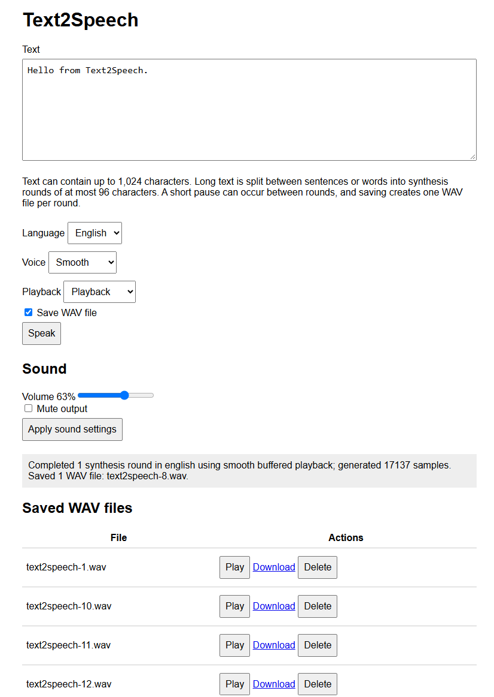

# Text2Speech for .NET nanoFramework

A managed, integer-only formant speech synthesizer for constrained .NET nanoFramework devices. The language-neutral core and the compact English and Phase 1 French frontends are distributed as separate assemblies and packages.

## Features

- Managed C# with no native runtime component or external voice data.
- Integer-only formant synthesis suitable for microcontrollers without an FPU.
- Division-free per-sample rendering with fixed-point interpolation and 24-bit oscillator phases.
- 2 kHz control-rate updates for pitch, formants, envelopes, and transitions while oscillators and noise remain at 8 kHz.
- Reused parser and renderer workspaces to reduce repeated allocations and garbage collection.
- Built-in English and French spelling-to-phoneme rules, number expansion, punctuation pauses, and statement/question intonation.
- French support for precomposed accents, oral and rounded vowels, four approximate nasal vowels, French consonants and glides, cardinal integers through 999,999,999, and accentual-group prosody.
- Public language, frontend, phoneme, and bounded-buffer APIs for allocation-conscious language packs.
- Streaming or buffered unsigned 8-bit mono PCM at 8,000 Hz.
- Canonical 44-byte PCM WAV header creation and validation.
- ESP32-S3-BOX-Lite sample with bilingual English/French synthesis-to-I2S playback and optional WAV playback.
- nanoFramework Test Framework coverage and nanoFramework.IoT.Device-style StyleCop enforcement.

At 8,000 Hz, audio occupies approximately 8,000 bytes per second plus the 44-byte WAV header.

## Projects

- `Text2Speech.nfproj`: language-neutral renderer, synthesis API, segmentation contracts, PCM sinks, and WAV support.
- `Languages\English\Text2Speech.English.nfproj`: English normalization, spelling rules, and acoustic definitions.
- `Languages\French\Text2Speech.French.nfproj`: French normalization, spelling rules, and acoustic definitions.
- `samples\Text2Speech.Samples\Text2Speech.Samples.nfproj`: internal-storage and ESP32 I2S sample.
- `samples\Text2Speech.WebServerSample\Text2Speech.WebServerSample.nfproj`: Wi-Fi browser interface for synthesis, playback, and WAV management.
- `tests\Text2Speech.Tests\Text2Speech.Tests.nfproj`: simulator-compatible unit tests.
- `Text2Speech.sln`: complete solution.


### NuGet packages

The package specifications follow the nanoFramework IoT.Device layout and include the nanoFramework icon, XML documentation, managed DLL, PDB, PDBX, PE image, README, license, and attribution notice:

| Package | Assembly | Dependencies |
| --- | --- | --- |
| `nanoFramework.Iot.Device.Text2Speech` | `Iot.Device.Text2Speech.dll` | `nanoFramework.CoreLibrary` |
| `nanoFramework.Iot.Device.Text2Speech.English` | Core and English assemblies | `nanoFramework.CoreLibrary` |
| `nanoFramework.Iot.Device.Text2Speech.French` | Core and French assemblies | `nanoFramework.CoreLibrary` |

Following the nanoFramework WebServer MCP and Skills package pattern, each language package is standalone: it contains the core assembly artifacts plus its language assembly and flattens the core package dependencies. Applications only need to install the selected language package, while the core-only package remains available for custom language frontends. Applications only pay the flash and initialization cost of the language assemblies they reference. The namespace remains `Iot.Device.Text2Speech` across all three assemblies. The core deliberately provides no parameterless or voice-only `TtsSynthesizer` constructor and no parameterless `TtsSegmenter` constructor, because those APIs would create a dependency on a particular language package.

The core `.nfproj` and `.nuspec` files are kept at the binding root. Each language-specific project and package specification is kept with its sources under `Languages\English` or `Languages\French`; samples and tests remain in their established folders.

### Source layout

Production source files keep the `Iot.Device.Text2Speech` namespace while being grouped by responsibility, with one top-level type per file:

- `Audio`: PCM sinks and canonical WAV helpers.
- `Synthesis`: the language-neutral synthesizer, segmenter, renderer, renderer lookup tables, voice controls, and public phoneme model.
- `Languages`: language and frontend extension contracts.
- `Languages\English`: English frontend source, spelling patterns, acoustic tables, and assembly metadata.
- `Languages\French`: French frontend source, bounded cardinal normalizer, contextual spelling rules, acoustic tables, and assembly metadata.
- `samples\Text2Speech.Samples\Audio`: ESP32-S3-BOX-Lite I2S playback and queue implementation.
- `samples\Text2Speech.Samples\Storage`: sample-only WAV file playback and streaming writer helpers.
- `samples\Text2Speech.WebServerSample\Controllers`: browser API and UI controller.
- `tests\Text2Speech.Tests\Audio` and `tests\Text2Speech.Tests\Synthesis`: tests grouped by the corresponding library area.

The web sample links the shared hardware and storage source files from their organized sample folders rather than duplicating them.

> [!Important] It is strongly recommended to have a device with I2S capabilities in order to play the sounds properly. While technically possible as well with a DAC. PSRAM recommended as well for best performances.

This is how the sample web interface looks like:



It allows selecting English or French, one of the three voice profiles, and buffered or live-streaming playback. You can also download, delete or play again any of the files. This is also a great demonstration of the amazing [.NET nanoFramework WebServer](https://github.com/nanoframework/nanoFramework.WebServer).

## Library usage

```csharp
ITtsLanguage language = EnglishTtsLanguage.Instance;
VoiceOptions voice = new VoiceOptions(
    pitchShift: -1,
    speedPercent: 95,
    formantScalePercent: 98,
    intonationPercent: 140,
    fricativeNoisePercent: 80,
    transitionSmoothingPercent: 150);

TtsSynthesizer synthesizer = new TtsSynthesizer(language, voice);
byte[] pcm = synthesizer.Speak("Hello from Text2Speech.");
byte[] header = WavPcm8Mono8000.CreateHeader(pcm.Length);
```

### Language frontends

The core has no default language dependency. Install the core package plus at least one language package, select the language explicitly, and pass the same definition to `TtsSynthesizer` and `TtsSegmenter`:

```csharp
ITtsLanguage language = EnglishTtsLanguage.Instance;
VoiceOptions voice = new VoiceOptions();
TtsSynthesizer synthesizer = new TtsSynthesizer(language, voice);
TtsSegmenter segmenter = new TtsSegmenter(language);
```

A language pack implements two small interfaces:

- `ITtsLanguage` is an immutable definition and factory. It reports a display name and deterministic per-round text limit, then creates an independent frontend for each synthesizer or segmenter.
- `ITtsLanguageFrontend` normalizes one text round, applies spelling, number, stress, and intonation rules, and appends acoustic phonemes to `TtsPhonemeBuffer`. It returns `false` instead of truncating when the fixed 128-phoneme capacity is exceeded.

`TtsPhoneme` is the renderer-neutral acoustic model. A language pack supplies formant frequencies, amplitudes, MIDI pitch, duration, voicing, and optional formant glides. `TtsPhonemeType` selects one of the shared renderer paths: voiced, fricative, stop, silence, or voiced fricative. Definitions are validated when constructed so invalid frequencies, amplitudes, pitches, durations, and glides fail before synthesis starts.

`TtsPhonemeBuffer.TryAdd` also has an overload with a local duration percentage.
This lets a frontend lengthen accented vowels or shorten unstressed material
without creating duplicate acoustic phoneme definitions. Existing frontends
using the pitch-only overload retain a 100% duration and byte-identical timing.

A minimal frontend has this shape:

```csharp
public sealed class ExampleLanguage : ITtsLanguage
{
    public string Name => "Example";
    public int MaximumTextLength => 96;

    public ITtsLanguageFrontend CreateFrontend()
    {
        return new ExampleFrontend();
    }
}

public sealed class ExampleFrontend : ITtsLanguageFrontend
{
    private static readonly TtsPhoneme Vowel = new TtsPhoneme(
        TtsPhonemeType.Voiced,
        730, 1090, 2440,
        6, 5, 2,
        45, 130,
        false,
        0, 0, 0);

    public bool TryPrepare(string text, TtsPhonemeBuffer phonemes)
    {
        for (int i = 0; i < text.Length; i++)
        {
            if (text[i] == 'a' && !phonemes.TryAdd(Vowel, 0))
            {
                return false;
            }
        }

        return true;
    }
}
```

Frontend instances may retain reusable normalization and lookup buffers, but should not allocate per phoneme. The synthesizer serializes calls on its frontend instance. A language definition must create a new frontend rather than sharing mutable parsing state across synthesizers. For embedded size, applications should reference only the language packs they deploy.

The shared renderer, PCM sinks, WAV support, continuous streaming, and I2S samples do not depend on the selected language. Languages requiring new acoustic categories, such as lexical tone contours beyond a per-phoneme pitch offset, may still require renderer extensions.

### Voice options

Voice controls are bounded for predictable embedded behavior:

| Control | Default | Range | Audible impact | Resource impact |
| --- | ---: | ---: | --- | --- |
| `pitchShift` | 0 | -12 to 12 | Moves the glottal pitch in semitones. Negative values sound lower; positive values sound higher. It does not change formants or speaking duration. Large shifts sound increasingly synthetic. | No meaningful change to output size or synthesis cost. |
| `speedPercent` | 100 | 60 to 160 | Changes every phoneme and pause duration. Values below 100 speak more slowly; values above 100 speak faster. Very high values can reduce intelligibility, while very low values exaggerate the robotic character. | Output length, synthesis time, pre-render RAM, and WAV size change inversely with speed. For example, 150% speed produces roughly two-thirds as many samples. |
| `formantScalePercent` | 100 | 80 to 120 | Scales vocal-tract resonances independently of pitch. Lower values produce a larger, darker voice; higher values produce a smaller, brighter voice. Extreme values can sound nasal or artificial. | No change to output length; only small fixed-point scaling work. |
| `intonationPercent` | 100 | 0 to 200 | Controls statement and question pitch movement. Zero produces a flat monotone, 100 preserves Text2Speech's normal contour, and values above 100 make phrasing more expressive. | No change to output length or meaningful CPU cost. |
| `fricativeNoisePercent` | 100 | 0 to 150 | Controls noisy consonants and stop bursts such as **s**, **f**, **sh**, **t**, and **k**. Lower values soften harsh consonants; zero can make words difficult to understand. Higher values improve consonant emphasis but can sound hissy. | No change to output length or meaningful CPU cost. |
| `transitionSmoothingPercent` | 100 | 0 to 200 | Controls blending between adjacent voiced phonemes. Zero makes formant changes abrupt; moderate increases can reduce robotic stepping. Excessive smoothing can smear vowels and consonant boundaries. | No change to output length; wider transitions affect more samples but use the same per-sample renderer path. |

All percentages use 100 as the original Text2Speech behavior. Options are immutable: create a new `TtsSynthesizer` when changing a voice profile. A synthesizer retains and reuses its parser and renderer workspaces; concurrent calls on the same instance are serialized for correctness.

Pitch and formants intentionally remain separate. Raising both creates a smaller, brighter character; lowering both creates a larger, darker character. Changing only pitch preserves more of the original vocal identity. Intonation is applied on top of the base pitch shift.

The ESP32-S3-BOX-Lite sample demonstrates four reusable synthesizers with different immutable profiles: a smooth voice, a faster bright voice, a deep voice, and a separate streaming voice. Select the desired synthesizer before each buffered or streaming call; the player and I2S device remain shared.

For tuning, change one option at a time and test a phrase containing vowels, fricatives, stops, a comma, and a question. Start with small adjustments: 1-2 semitones for pitch, 5-10% for speed or formants, and 20-30% for intonation, noise, or smoothing.

### Creating additional voice characters

`VoiceOptions` can provide a first approximation: a higher pitch and formant scale can suggest a smaller vocal tract, while lower values can suggest a larger or darker voice. Convincing female, child, or older-adult voices require more than one global preset. Create separately measured and tuned phoneme tables with appropriate base pitch ranges, vowel formants, amplitudes, durations, transitions, noise balance, and language-specific prosody, then expose each calibrated set as a reusable profile or language definition. Characteristics such as breathiness, vocal jitter, and age-related instability would require new bounded renderer controls because the current renderer does not model them explicitly. Validate candidate voices with varied phrases and multiple listeners; these profiles are acoustic approximations and should not be presented as universal characteristics of an age or gender group. See the [NOTICE] file which contains pointers on models and elements used to create the French male model and improve the English one.

For constrained devices, prefer `Speak(string, IPcmSink)`. It emits reusable 2,048-byte blocks rather than allocating the complete utterance, reducing filesystem and managed/native write overhead at a fixed 2 KB working-memory cost. Each synthesizer call accepts up to 96 characters and uses a fixed 128-phoneme workspace. Applications handling longer text should split it at sentence or word boundaries and synthesize each bounded round separately.

`TeePcmSink` is part of the core library because it depends only on `IPcmSink`. It forwards every PCM block to two destinations in order, allowing one synthesis pass to feed combinations such as playback and WAV storage without introducing hardware-specific dependencies.

Use `TtsSegmenter` to apply those boundaries consistently. It prefers sentence endings, then whitespace, and splits inside a word only when no boundary is available. It also verifies the expanded phoneme count and subdivides expansion-heavy segments when required:

```csharp
TtsSegmenter segmenter = new TtsSegmenter(synthesizer.Language);
string[] segments = segmenter.Split(longText);
for (int i = 0; i < segments.Length; i++)
{
    synthesizer.Speak(segments[i], sink);
}
```

The returned array contains only independently synthesizable rounds. Process one round at a time so buffered playback never holds PCM for the complete long passage.

Streaming blocks intentionally follow fixed PCM sizes rather than word boundaries. The parser preserves word spaces and full-sentence intonation while the renderer carries transitions continuously across the utterance. Flushing at every word would create smaller, irregular queue entries and additional synchronization without increasing synthesis throughput or allowing managed code to run during a blocking native I2S write.

The public PCM representation is unsigned 8-bit mono. The renderer internally produces signed samples and converts them by adding 128 for WAV compatibility.

## Direct I2S and WAV playback

The sample targets the **ESP32-S3-BOX-Lite** playback path and initializes the board's ES8156 DAC with the `nanoFramework.Iot.Device.Es8156` binding. Its default path first synthesizes compact 8-bit mono PCM in RAM and then sends it to I2S, avoiding file creation, flash writes, WAV reopening, and flash reads:

InterpolatedI2sPcmSink intentionally remains in the sample rather than the core library. The core package is hardware-independent and depends only on nanoFramework CoreLibrary; moving the sink would force all users to reference I2S, threading, and device-specific playback APIs even when they only generate PCM, write WAV files, or use another output transport. IPcmSink is the core extension boundary for hardware integrations. If the I2S implementation becomes a reusable supported component beyond these samples, it should move to a separate optional package such as Iot.Device.Text2Speech.I2s, not into the synthesis core.

```csharp
int samples = player.Speak(synthesizer, "Hello from Text2Speech.");
```

Playback mode is selected when the player creates its fixed-rate I2S device. The no-argument constructor preserves interpolated 16 kHz playback. Fast 8 kHz mode skips midpoint interpolation and halves the generated I2S frames:

```csharp
Esp32S3BoxLiteWavPlayer player =
    new Esp32S3BoxLiteWavPlayer(I2sPlaybackMode.Fast8Khz);
```

The sample selects fast 8 kHz mode for its buffered and streaming benchmarks. It reduces managed conversion work and uses an 8 KB conversion buffer instead of 16 KB, at the cost of rougher high-frequency audio. Both modes still send signed 16-bit interleaved stereo samples to the ES8156.

Pre-rendering guarantees smooth playback even when managed synthesis is slower than real time. Its temporary memory cost is approximately 8 KB per second of generated speech. `SpeakStreaming(...)` remains available for minimum startup latency, but can underrun on slower targets.

The caller can optionally provide a full WAV path to either speech method. The generated file always contains the compact source format - unsigned 8-bit mono at 8 kHz - regardless of the selected I2S playback mode, and can be replayed without synthesizing again:

```csharp
string bufferedPath = @"I:\greeting.wav";
player.Speak(synthesizer, "Hello from Text2Speech.", bufferedPath);
player.Play(bufferedPath);

string streamingPath = @"I:\live.wav";
player.SpeakStreaming(synthesizer, "Save this while speaking.", streamingPath);
player.Play(streamingPath);
```

An existing destination is overwritten. Streaming uses a tee sink so each generated 2 KB PCM block is queued for playback and written to the WAV file in the same synthesis pass. Flash-write latency consumes some streaming headroom; use buffered saving when startup latency is unimportant or storage is slow. If streaming synthesis or playback fails, the incomplete WAV is closed and removed rather than exposed as reusable output.

The sample uses `TtsSegmenter` for every phrase, so callers can replace a sample string with longer text without changing the playback code. Buffered playback processes one segment at a time. Live streaming keeps one producer-consumer session active across every segment, so synthesis of the next round can continue while queued audio from the previous round is playing. Both modes log the total round count. Buffered playback reports source samples, expected audio duration, synthesis time, synthesis speed as a percentage of real time, and playback time. A value above 100% means synthesis is faster than playback; below 100% means live streaming cannot remain continuous without pre-rendering. Streaming playback reports total elapsed time and its difference from the expected audio duration.

```text
[buffered:smooth] rounds=2, samples=24000, audio=3000 ms, synthesis=1500 ms, synthesis-speed=200% real-time, playback=3010 ms.
[streaming:streaming] rounds=2, samples=24000, audio=3000 ms, total=3800 ms, overhead=800 ms.
```

ESP32-S3-BOX-Lite wiring:

- I2C bus 1: SDA GPIO8, SCL GPIO18 (ES8156 control)
- I2S bus 1: MCLK GPIO2, BCLK GPIO17, WS/LRCLK GPIO47, DOUT GPIO15
- Speaker amplifier enable: GPIO46
- WAV sample rate: 8,000 Hz
- I2S playback rate: 8,000 Hz in fast mode or 16,000 Hz in interpolated mode
- I2S transport: signed 16-bit interleaved stereo

The I2S peripheral is created and primed with silence before the ES8156 is initialized, because the slave codec needs MCLK/BCLK/WS running while its registers are configured. The amplifier remains disabled until the codec is initialized and unmuted. Configured I2S routes are read back and validated before playback.

Playback uses a bounded producer-consumer pipeline after PCM is available. It copies 2,048-byte source blocks into an eight-block queue while a below-normal-priority playback thread performs conversion and I2S writes, allowing synthesis to refill the queue first. The queue costs about 16 KB of RAM, in addition to an 8 KB fast-mode or 16 KB interpolated-mode conversion buffer. The lower-priority playback worker yields after each source block so synthesis can refill the queue instead of being starved by blocking writes. The ESP32 I2S device uses a 40 KB DMA buffer, matching the ES8156 IoT.Device sample, so native playback can continue while managed synthesis runs. The default pre-rendered path fills this pipeline from memory fast enough to prevent underruns; the optional streaming path starts after seven blocks are ready and provides approximately 1,792 ms of managed-queue headroom plus native DMA buffering. This increases startup latency but covers short synthesis and conversion deficits that would otherwise cause audible underruns. Multi-round text pays this startup cost only once: the queue, conversion state, and playback worker remain active until every round has been synthesized, and optional WAV writers rotate without draining playback.

Streaming playback also prints an `[i2s-diagnostic]` line. It reports the configured startup-block count, queue depth and wait times, managed conversion count and duration, native write count and duration, and two overlap indicators. The player defaults to four 2,048-sample startup blocks, providing approximately 1.024 seconds of source-audio reserve at 8 kHz; callers can select from one through eight blocks when constructing `Esp32S3BoxLiteWavPlayer` to trade startup latency for underrun protection. `managed-heartbeats-during-i2s` counts executions of a low-priority 50 ms diagnostic heartbeat while native writes are active; `samples-queued-during-i2s` counts source samples delivered by synthesis during those writes. Long native write time with both values at zero indicates that `I2sDevice.Write()` blocks managed execution globally. Producer waits indicate a full queue, consumer waits after startup indicate that synthesis is not feeding PCM quickly enough, and conversion time measures interpolation and stereo PCM packing on the playback worker.

Both direct and WAV playback accept compact 8 kHz, unsigned 8-bit mono source PCM. Fast mode converts each source sample directly into one 8 kHz stereo frame. Interpolated mode produces the original sample and a linear midpoint, yielding 16 kHz output. Every signed 16-bit result is duplicated into the left and right I2S slots expected by the codec:

```text
current16 = (current8 - 128) << 8
fastFrames = [current16 stereo]
midpoint16 = (previous16 + current16) / 2
interpolatedFrames = [previous16 stereo, midpoint16 stereo]
```

The ES7243E microphone capture path is separate and is not needed for WAV playback. The firmware must expose internal storage as `I:` and include the filesystem, GPIO, I2C, I2S, and ESP32 native assemblies. Deployment, storage mounting, MCLK generation, amplifier operation, and audio quality must still be validated on the physical board.

## Web server sample

The web server sample targets the ESP32-S3-BOX-Lite and reuses the fast 8 kHz ES8156 playback implementation. The direct hardware sample plays buffered English and French phrases, then demonstrates continuous multi-round streaming in French. Set the Wi-Fi network directly in `samples\Text2Speech.WebServerSample\Program.cs` before deployment:

```csharp
private const string WifiSsid = "YOUR_WIFI_SSID";
private const string WifiPassword = "YOUR_WIFI_PASSWORD";
```

At startup, the sample uses `WifiNetworkHelper.ConnectDhcp` when both constants are provided. If either value is null or empty, it uses `WifiNetworkHelper.Reconnect` with credentials already stored on the device. It then prints the assigned browser URL to the debugger, initializes the ES8156 audio path, and starts `nanoFramework.WebServer` on HTTP port 80. The firmware must include Wi-Fi, networking, HTTP server, filesystem, threading, GPIO, I2C, I2S, and ESP32 native assemblies. Internal storage must be mounted as `I:`.

The sample targets the stable nanoFramework package family. The firmware native-assembly checksums must match the managed packages used to build the application; native versions such as `v100.x` are not directly comparable to managed NuGet versions such as `v1.5.x`. If deployment reports a checksum mismatch for `System.Net` or `System.Device.Wifi`, update the ESP32-S3 firmware to a release matching the current stable package stack. Deploy `Text2Speech.WebServerSample`; the deployment tool will correctly skip the non-executable `Text2Speech` library project.

The page at `/` provides:

- Text input up to 1,024 characters. The server prefers sentence boundaries and then word boundaries when splitting it into synthesis rounds of at most 96 characters. Buffered mode can pause briefly between rounds; streaming mode keeps one continuous playback session.
- English or French language selection, with language-aware segmentation and synthesis.
- Smooth, fast-bright, and deep predefined voice profiles for either language.
- Hardware output volume from 0% through 100% and a mute control, applied to speech and saved-WAV playback.
- Buffered playback or live streaming selection.
- WAV saving enabled by default, with one counter-named WAV file created for every synthesis round.
- A live list of saved WAV files with device playback, download, and delete actions.

Saved files use the first available `I:\text2speech-N.wav` counter name. Long requests create multiple sequential files, one for each synthesis round. The counter checks existing files before writing, so a restart does not overwrite earlier recordings. File, synthesis, and playback operations are serialized to prevent deleting or downloading a WAV while it is being written.

HTTP routes:

- `GET /`: static browser application.
- `POST /speak`: URL-encoded language, text, voice, playback mode, and save option.
- `POST /sound`: validated codec volume percentage and mute state.
- `GET /files`: current WAV file table fragment.
- `POST /play`: validated playback of a stored canonical unsigned 8-bit mono 8 kHz WAV through the device.
- `GET /download?name=...`: WAV download.
- `POST /delete`: validated WAV deletion.

The web project links the tested ESP32-S3-BOX-Lite player sources from the existing I2S sample rather than maintaining a second playback implementation.

## Build

Use the nanoFramework Visual Studio/VS Code build workflow:

```powershell
nuget restore Text2Speech.sln -PackagesDirectory packages -NonInteractive
msbuild Text2Speech.sln /p:platform="Any CPU" /p:Configuration=Release /verbosity:minimal
```

If `msbuild` is not on `PATH`, locate the Visual Studio MSBuild executable with `vswhere` and invoke it directly. StyleCop findings fail the build.
To validate the IoT.Device-style packages after a Release build, provide one version to all three specifications:

```powershell
nuget pack Text2Speech.nuspec -Version 1.0.0 -Properties commit=LOCAL
nuget pack Languages\English\Text2Speech.English.nuspec -Version 1.0.0 -Properties commit=LOCAL
nuget pack Languages\French\Text2Speech.French.nuspec -Version 1.0.0 -Properties commit=LOCAL
```

## Tests

The test project uses `nanoFramework.TestFramework`, `nanoFramework.UnitTestLauncher`, and the nanoFramework VSTest adapter. Build the Release solution first, then run `tests\Text2Speech.Tests\bin\Release\NFUnitTest.dll` using `tests\Text2Speech.Tests\nano.runsettings`. The checked-in settings use the nanoCLR simulator (`IsRealHardware=False`).

Tests cover format constants, deterministic synthesis, buffered/streamed equivalence, number expansion, frontend rules, invalid input, WAV headers, and malformed/truncated WAV rejection.

## Constraints

- The separately packaged English and French frontends are intentionally compact; other languages require their own `ITtsLanguage` and `ITtsLanguageFrontend` implementation, phoneme inventory, normalization, spelling, stress, and intonation rules.
- French pronunciation is rule based. Its embedded prosody was distilled from HI! PARIS SSML output and French accentual-group behavior: approximately 2% slower segment timing, short word joins, final-vowel lengthening, continuation rises, declarative falls, question rises, and differentiated comma, clause, and terminal pauses. It does not provide a full lexicon, optional liaison, grammatical disambiguation, or exact acoustic nasal coupling, so irregular and context-sensitive words remain approximate.
- French oral-vowel F1/F2 targets are conservatively calibrated halfway toward single-speaker native-French measurements extracted from the Cnam-LMSSC Multilingual LibriSpeech French Phoneme dataset. F3, amplitudes, pitch, duration, schwa, and nasal-vowel targets remain independently tuned so acoustic changes can be evaluated separately.
- English F1/F2 targets with direct General American matches are conservatively calibrated using numerical outputs independently calculated by the local acoustic-analysis pipeline. Diphthong targets use independently calculated early and late vowel contours. F3, amplitudes, pitch, duration, unsupported vowels, and rhotic variants without direct matches remain independently tuned.
- To generate the French Prosology, we've been using HI! PARIS two-stage Qwen2.5-7B cascade on a host computer and converts its SSML into bounded pitch, speed, volume, and pause controls. The generated controls are development artifacts; the firmware frontend continues to use its built-in deterministic contour until a continuous span-level runtime bridge is added.
- Input and phonemes are bounded by the selected language and the fixed 128-entry `TtsPhonemeBuffer` to keep memory deterministic.
- The 8 kHz output favors size and embedded cost over high-fidelity speech.
- Calls reset renderer state for deterministic output and are safe to use through separate synthesizer calls; a sink must consume each block synchronously.

## License and attribution

This repository is MIT licensed. The managed engine is derived from PebbleTalk at commit `8ddfbb60b9cd940a8ef4a24c3787ad211b19b003`, copyright (c) 2026 neonfire, also under the MIT License. English acoustic constants are independently calculated outputs of the local calibration pipeline; source measurements and recordings are not included. French spelling rules are independently adapted from Epitran French data (MIT, copyright 2016 David Mortensen), French cardinal behavior is adapted from Unicode CLDR data (Unicode License v3), and French oral-vowel calibration uses measurements derived from the Cnam-LMSSC Multilingual LibriSpeech French Phoneme dataset (CC BY 4.0). Host-side prosody tooling interoperates with the MIT-licensed HI! PARIS Prosody-Control-French-TTS project and separately downloaded Apache-2.0 models. See `LICENSE` and `NOTICE`.
