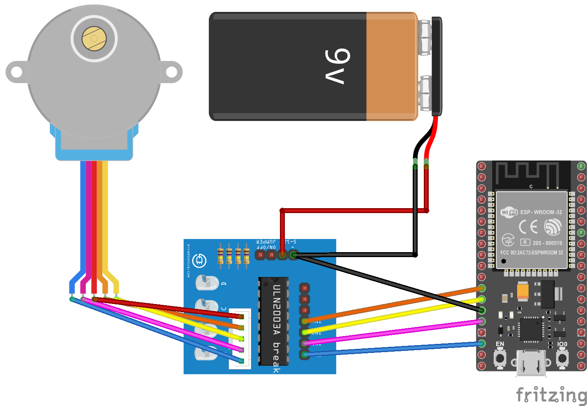

# 28BYJ-48 Stepper Motor 5V 4-Phase 5-Wire & ULN2003 Driver Board

A stepper motor is an electromechanical device which converts electrical pulses into discrete mechanical movements. The shaft or spindle of a stepper motor rotates in discrete step increments when electrical command pulses are applied to it in the proper sequence. The motors rotation has several direct relationships to these applied input pulses. The sequence of the applied pulses is directly related to the direction of motor shafts rotation. The speed of the motor shafts rotation is directly related to the frequency of the input pulses and the length of rotation is directly related to the number of input pulses applied.One of the most significant advantages of a stepper motor is its ability to be accurately controlled in an open loop system. Open loop control means no feedback information about position is needed. This type of control eliminates the need for expensive sensing and feedback devices such as optical encoders. Your position is known simply by keeping track of the input step pulses.

## Documentation

The 28BYJ-48 is a small stepper motor suitable for a large range of applications. More information [here](https://components101.com/motors/28byj-48-stepper-motor)

**[Stepper Motor 28BYJ-48]**: <http://www.geeetech.com/Documents/Stepper%20motor%20datasheet.pdf>

**[ULN2003]**: <http://www.geeetech.com/Documents/ULN2003%20datasheet.pdf>

## Board




On schematics ULN2003APG driver is being used. You can use  external power (9V as on scheme above) or just 5V Rapberry Pi PIN instead (Physical pin 2,4).

## Usage

```csharp
// Pinout for MCU please adapt depending on your MCU
// Any regular GPIO will work
const int bluePin = 4;
const int pinkPin = 17;
const int yellowPin = 27;
const int orangePin = 22;

using (Uln2003 motor = new Uln2003(bluePin, pinkPin, yellowPin, orangePin))
{
  while (true)
  {
    // Set the motor speed to 15 revolutions per minute.
    motor.RPM = 15;
    // Set the motor mode.  
    motor.Mode = StepperMode.HalfStep;
    // The motor rotate 2048 steps clockwise (180 degrees for HalfStep mode).
    motor.Step(2048);

    motor.Mode = StepperMode.FullStepDualPhase;
    motor.RPM = 8;
    // The motor rotate 2048 steps counterclockwise (360 degrees for FullStepDualPhase mode).
    motor.Step(-2048);

    motor.Mode = StepperMode.HalfStep;
    motor.RPM = 1;
    motor.Step(4096);
  }
}
```
