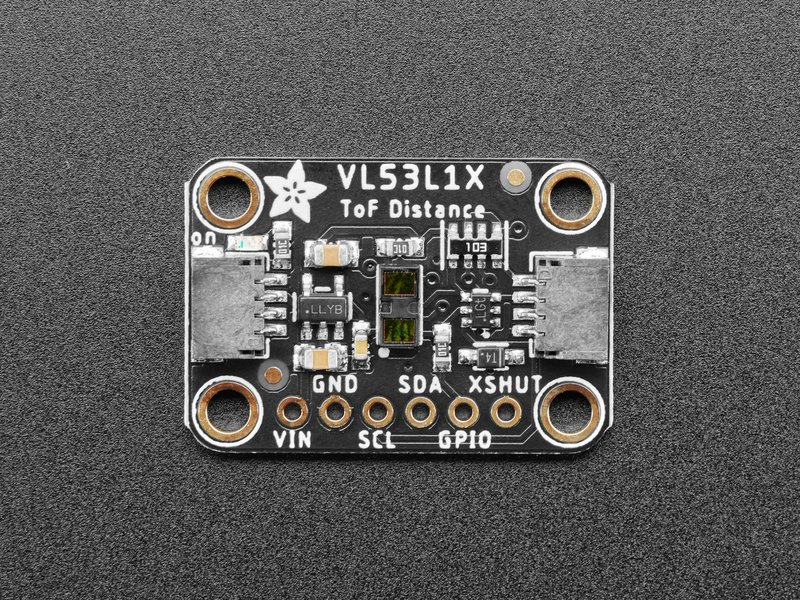

# VL53L1X distance sensor

The VL53L1X is a Time-of-Flight laser-ranging sensor with accurate ranging up to 4 m and a ranging frequency up to 50 Hz. It integrates a SPAD receiving array, a 940 nm Class 1 laser emitter, infrared filters, and programmable region-of-interest (ROI) support.

## Documentation

- [VL53L1X product page and datasheet](https://www.st.com/en/imaging-and-photonics-solutions/vl53l1x.html)
- [VL53L1X ultra-lite driver](https://www.st.com/en/embedded-software/stsw-img009.html)
- [Adafruit VL53L1X breakout](https://www.adafruit.com/product/3967)



## Wiring

Connect VIN to the board supply, GND to ground, SDA to the I2C data pin, and SCL to the I2C clock pin. The XSHUT pin may be left pulled high for a single sensor. On ESP32, the sample uses GPIO21 for SDA and GPIO22 for SCL on I2C bus 1.

| VL53L1X | ESP32 |
|---|---|
| VIN | 3.3 V |
| GND | GND |
| SDA | GPIO21 |
| SCL | GPIO22 |

## Usage

All calibration and initial setup are performed when the binding is created. Make sure the device is enabled through the XSHUT pin before constructing the sensor.

```csharp
Configuration.SetPinFunction(Gpio.IO21, DeviceFunction.I2C1_DATA);
Configuration.SetPinFunction(Gpio.IO22, DeviceFunction.I2C1_CLOCK);

I2cConnectionSettings settings = new(1, Vl53L1X.DefaultI2cAddress);
using I2cDevice i2cDevice = I2cDevice.Create(settings);
using Vl53L1X sensor = new(i2cDevice);

sensor.Precision = Precision.Short;

while (true)
{
    Debug.WriteLine($"Distance: {sensor.Distance.Millimeters} mm");
    Debug.WriteLine($"Range status: {sensor.RangeStatus}");
    Thread.Sleep(500);
}
```
