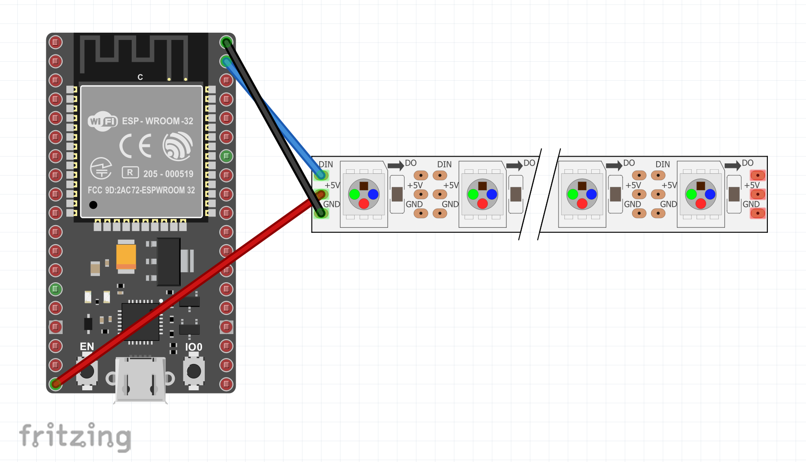

# Ws28xx, SK6812 LED drivers

This binding allows you to update the RGB LEDs on Ws28xx, SK6812 and based strips and matrices.

To see how to use the binding in code, see the [sample](samples/Program.cs).

> Important: This implementation is for ESP32 boards only. Do not use with other boards. USe the [SPI implementation](../Ws28xx/README.md) instead.

## Documentation

* WS2812B: [Datasheet](https://cdn-shop.adafruit.com/datasheets/WS2812B.pdf)
* WS2815B: [Datasheet](http://www.world-semi.com/DownLoadFile/138)
* WS2808: [Datasheet](https://datasheetspdf.com/pdf-file/806051/Worldsemi/WS2801/1)
* SK6812: [Datasheet](https://cdn-shop.adafruit.com/product-files/2757/p2757_SK6812RGBW_REV01.pdf)
* [Neo pixels guide](https://learn.adafruit.com/adafruit-neopixel-uberguide)
* [Neo pixels x8 stick](https://www.adafruit.com/product/1426)

## Board

### WS2812B



## Usage

```csharp
using Iot.Device.Ws28xx.Esp32;
using System.Diagnostics;
using System.Drawing;

// Configure the count of pixels
const int Count = 10;
// Adjust the pin number
const int Pin = 15;

// Use Ws2812 or SK6812 instead if needed
Ws28xx neo = new Ws2808(Pin, Count);
Rainbow(neo, Count);

void Rainbow(Ws28xx neo, int count, int iterations = 1)
{
    BitmapImage img = neo.Image;
    for (var i = 0; i < 255 * iterations; i++)
    {
        for (var j = 0; j < count; j++)
        {            
            img.SetPixel(j, 0, Wheel((i + j) & 255));
        }

        neo.Update();
    }
}
```

## Using BitmapImage

The `BitmapImage` gives you the opportunity to work on rectangular matrix. For example is you are using a M5Stack Atom Matrix, you'll be able to use a 5 x 5 matrix. In this case, you'll be able to set a specific pixel with coordinates using the `SetPixel` function.

Also nothing is display before the `Update` function is called.

## Advance usage

The Ws28xx class provide a generic driver. In case your strip is not supported or colors are inverted or coded in a different number of colors, you can use specific definitions and create your own class. Here is the example for the SK6812 used in the M5Stack Fire for example:

```csharp
public Sk6812(int gpioPin, int width, int height = 1)
    : base(gpioPin, new BitmapImageWs2808Grb(width, height))
{
    ClockDivider = 4;
    OnePulse = new(14, true, 12, false);
    ZeroPulse = new(7, true, 16, false);
    ResetCommand = new(500, false, 520, false);
}
```

The various `BitmapImage***` classes already take into account the color schemes, the bit per color coding. Use one of them to accommodate your needs.

The pulses are calculated based on the datasheet of each driver. A `OnePulse` is a pulse coding for a bit high = 1. A `ZeroPulse` is coding for a bit low = 0. And a `ResetCommand` is the command used in some drivers at the end of the pulse chain.

Each pulse is 80MHz based and then divided by the `ClockDivider`. You have to take this into account to make the proper math for the pulses.

## Limitations

If you are using a very very long chain, depending on your board and the memory available on it, you can be out of memory while preparing the pulse chain to send.
