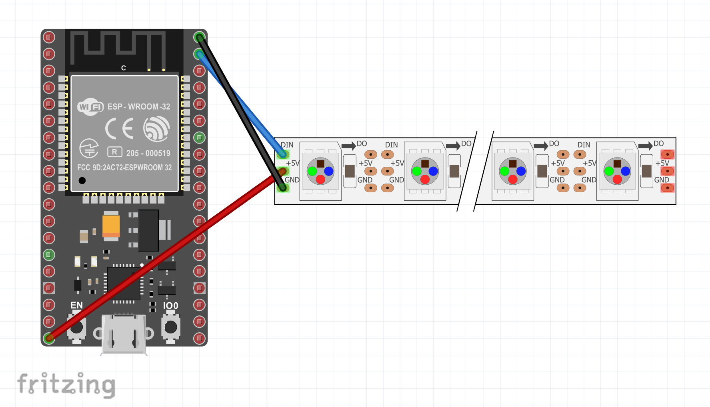

# Ws28xx LED drivers

This binding allows you to update the RGB LEDs on Ws28xx and based strips and matrices.

To see how to use the binding in code, see the [sample](samples/Program.cs).

## Documentation

* WS2812B: [Datasheet](https://cdn-shop.adafruit.com/datasheets/WS2812B.pdf)
* WS2815B: [Datasheet](http://www.world-semi.com/DownLoadFile/138)
* WS2808: [Datasheet](https://datasheetspdf.com/pdf-file/806051/Worldsemi/WS2801/1)
* SK6812: [Datasheet](https://cdn-shop.adafruit.com/product-files/2757/p2757_SK6812RGBW_REV01.pdf)
* [Neo pixels guide](https://learn.adafruit.com/adafruit-neopixel-uberguide)
* [Neo pixels x8 stick](https://www.adafruit.com/product/1426)

## Board

### WS2812B




## Usage

```csharp
using System;
using System.Collections.Generic;
using System.Device.Spi;
using System.Drawing;
using Iot.Device.Graphics;
using Iot.Device.Ws28xx;

// Configure the count of pixels
const int Count = 8;
Console.Clear();

// Must specify pin functions on ESP32
Configuration.SetPinFunction(23, DeviceFunction.SPI2_MOSI);
Configuration.SetPinFunction(19, DeviceFunction.SPI2_MISO);
Configuration.SetPinFunction(18, DeviceFunction.SPI2_CLOCK);
Configuration.SetPinFunction(22, DeviceFunction.ADC1_CH10);

// Using VSPI on bus 2 for ESP32 and pin 22 for chipselect
SpiConnectionSettings settings = new(2, 22)
{
    ClockFrequency = 2_400_000,
    Mode = SpiMode.Mode0,
    DataBitLength = 8
};
using SpiDevice spi = SpiDevice.Create(settings);

Ws28xx neo = new Ws2808(spi, count);
//Ws28xx neo = new Ws2812b(spi, Count);

while (true)
{
    Rainbow(neo, Count);
    System.Threading.Thread.Sleep(100);
}

void Rainbow(Ws28xx neo, int count, int iterations = 1)
{
    BitmapImage img = neo.Image;
    for (var i = 0; i < 255 * iterations; i++)
    {
        for (var j = 0; j < count; j++)
        {
            img.SetPixel(j, 0, Wheel((i + j) & 255));
        }

        neo.Update();
    }
}
```
