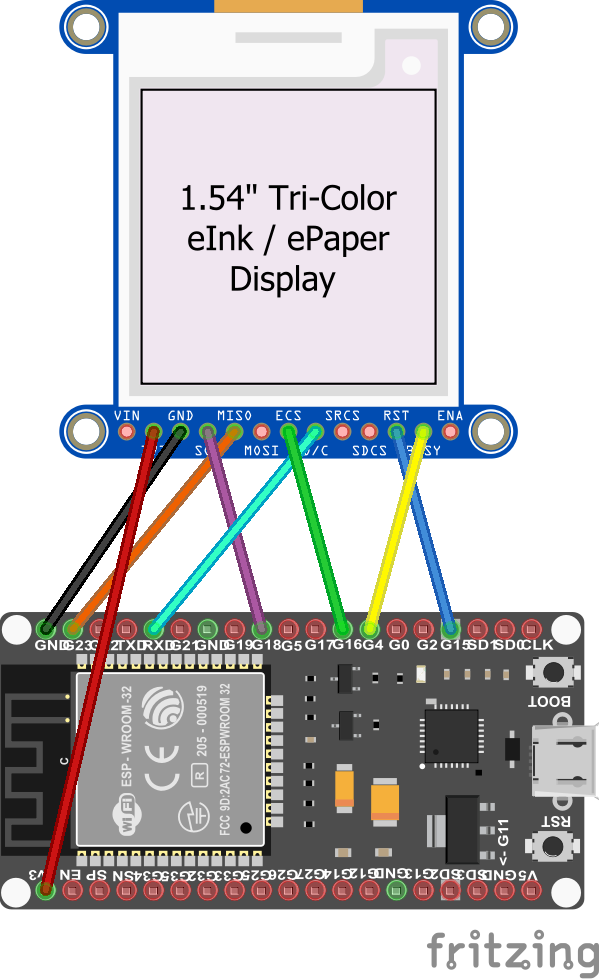
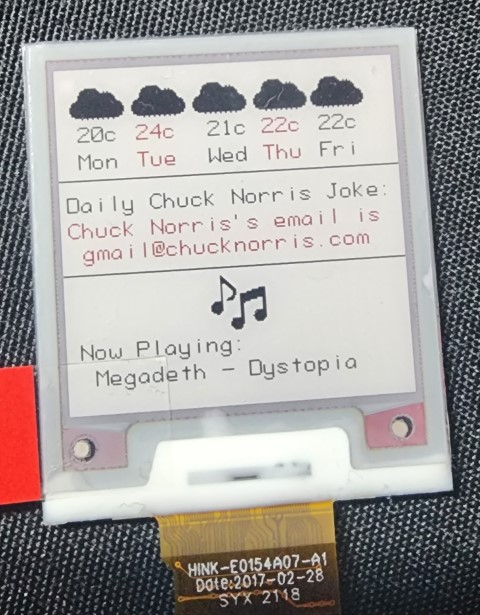

# ePaper drivers for .NET nanoFramework

This is a C# library to bring support for various ePaper displays to nanoFramework. It contains the drivers with a graphics library that provides APIs to draw text, lines, and shapes.

## Currently Supported ePaper Displays

There are various EPD Display Controllers out there. The following are the Controllers we support. More Controllers will be supported in future releases.

- SSD1681: 200 Source, 200 Gate Red/Black/White Active Matrix EPD Display Driver with Controller. [Datasheet](https://www.buydisplay.com/download/ic/SSD1681.pdf)

### Upcoming support:

- SSD1680: 176 Source x 296 Gate Red/Black/White Active Matrix EPD Display Driver with Controller.
- UC8151D: All-in-one driver IC w/ Timing Controller for White/Black/Red Dot-Matrix Micro-Cup ESL.
- And more...

## Circuit



An ePaper display uses 3-Wire (or 4-Wire) `SPI` to communicate with an `MCU`. Supply voltage varies depending on the display and controller. Refer to the datasheet for more information.

The circuit above shows an ePaper display based on the `SSD1681` controller wired to an ESP32 Dev Board. The display communicates using 3-Wire `SPI` and requires 3.3V. Additionally, a Data/Command, Reset, and Busy pin are also connected as they are required to initialize the display and send commands and data to it.

*Refer to your development board's pinout and the display controller datasheet for more info. The above might not work with your specific board and/or display.*

## 'Hello World' Sample

The following code snippet shows you how to write the famous `Hello World` message to the display using the included graphics libary.

Start by creating a new nanoFramework project and reference this library. Replace the contents of `Main` with the following:

```csharp
// Create an instance of the GPIO Controller.
// The display driver uses this to open pins to the display device.
// You could also pass null to Ssd1681 instead of a GpioController instance and it will make one for you.
using var gpioController = new GpioController();

// Setup SPI connection with the display
var spiConnectionSettings = new SpiConnectionSettings(busId: 1, chipSelectLine: 22)
{
	ClockFrequency = Ssd1681.SpiClockFrequency,
	Mode = Ssd1681.SpiMode,
	ChipSelectLineActiveState = false,
	Configuration = SpiBusConfiguration.HalfDuplex,
	DataFlow = DataFlow.MsbFirst
};

using var spiDevice = new SpiDevice(spiConnectionSettings);

// Create an instance of the display driver
using var display = new Ssd1681(
	spiDevice,
	resetPin: 15,
	busyPin: 4,
	dataCommandPin: 5,
	width: 200,
	height: 200,
	gpioController,
	enableFramePaging: true,
	shouldDispose: false);

// Power on the display and initialize it
display.PowerOn();
display.Initialize();

// clear the display
display.Clear(triggerPageRefresh: true);

// initialize the graphics library
using var gfx = new Graphics(display)
{
	DisplayRotation = Rotation.Default
};

// a simple font to use
// you can make use your own font by implementing IFont interface
var font = new Font8x12();

// write text to the internal graphics buffer
gfx.DrawText("Hello World", font, x: 0, y: 0, Color.Black);

// flush the buffer to the display and then initiate the refresh sequence
display.Flush();
display.PerformFullRefresh();

// Done! now put the display to sleep to reduce its power consumption
display.PowerDown(Ssd1681.SleepMode.DeepSleepModeTwo);
```

Refer to the `SSD1681` sample project for a more comprehensive example of using the driver and the graphics library. The result of that sample is drawing this on the display:



## Graphics Library Features

The graphics library is separate from the drivers. All drivers should implement the `IePaperDisplay` interface. This allows the graphics library to talk to any of the drivers.

### Paged Frame Draws

On top of the support for drawing text, lines, some shapes, and raw bitmaps, the graphics library supports working in low-memory conditions using paged frame draws.

A 200x200 Black & White display requires about 5KB (200 x 200 / 8) of Frame Buffer to be stored in RAM. If paged frame drawing is enabled, the frame is split into 5 pages with only 1 page being present in RAM at any time. This drops the RAM requirements for this library to about 1KB only (there are some additional, fixed, allocations for other primitive fields).

However, enabling paged frame draws ***can increase the time required to draw a frame***. There are some tricks you could employ to speed up a paged frame draw but will still be slower than a non-paged draw.

- Try to fit drawings within a single frame page. For a display with 200 pixels in height, a frame page will be 200 pixels wide by 40 pixels high. If your draw operation is less than 40 pixels high, it will fit within that page.
- The graphics library provides an API (`IsRangeWithinFrameBuffer(Point, Point)`) within the `IFrameBuffer` object to check if a range of points fit within the page. Use that API in conjunction with first point to improve drawing speed.

Refer to [Picture Loop](https://github.com/olikraus/u8glib/wiki/tpictureloop) for more information on why this is needed and some of the limitations.
Refer to the `SSD1681` sample project for details on the APIs and speed-up tricks.

Finally, this all depends on your hardware. If your MCU has enough RAM to hold the entire frame buffer of your display, and your software doesn't need that RAM, then consider turning off this feature.

### Fonts

The graphics library ships with a single ASCII, 8x12 font (Characters are 8 pixels wide, 12 pixels high). This is to reduce the amount of storage space required for this library. If you need to use a different font (different language, size, style, etc...), you can make your own by implementing the `IFont` interface.

A software like [The Dot Factory](http://www.eran.io/the-dot-factory-an-lcd-font-and-image-generator/) can help you take an existing font on your machine and turn it into a compatible byte array representation.

### Rotation

The library supports rotating the frame to match the display's rotation.

## Advanced

While the driver classes are designed to make using an ePaper in your project easy, they don't attempt to hide or prevent you from having more control over their functions. All drivers provide public helper methods to facilitate sending raw commands and data to the display controllers if you need to change something. Refer to the controller's datasheet first.