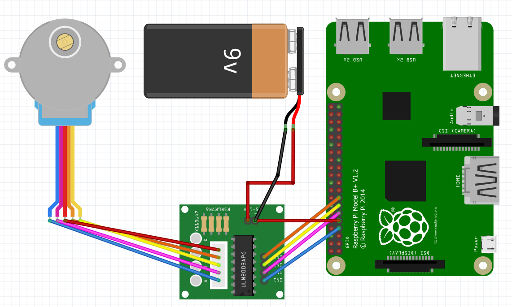

# Example of stepper motor 28BYJ-48

## Circuit


This wiring diagram illustrates usage of the ULN2003APG stepper motor driver module with a Raspberry Pi. For other boards like the ESP32-WROOM-32E, any GPIO pins can be used to control the ULN2003APG stepper motor driver module. External power supply is recommended, but not strictly necessary.

## Code

You can create a stepper motor with the following line:

```C#
Uln2003 motor = new Uln2003(bluePin, pinkPin, yellowPin, orangePin)
```

In the constructor, you will need to pass the number of used PINs.

```C#
// Pinout for ESP32-WROOM-32E
const int bluePin = 4;
const int pinkPin = 17;
const int yellowPin = 27;
const int orangePin = 22;

Debug.WriteLine($"Let's go!");
using (Uln2003 motor = new Uln2003(BluePin, PinkPin, YellowPin, OrangePin))
{
    while (true)
    {
        // Set the motor speed to 15 revolutions per minute.
        motor.RPM = 15;
        // Set the motor mode.
        motor.Mode = StepperMode.HalfStep;
        // The motor rotate 2048 steps clockwise (180 degrees for HalfStep mode).
        motor.Step(2048);

        motor.Mode = StepperMode.FullStepDualPhase;
        motor.RPM = 8;
        // The motor rotate 2048 steps counterclockwise (360 degrees for FullStepDualPhase mode).
        motor.Step(-2048);

        motor.Mode = StepperMode.HalfStep;
        motor.RPM = 1;
        motor.Step(4096);
    }
}```
