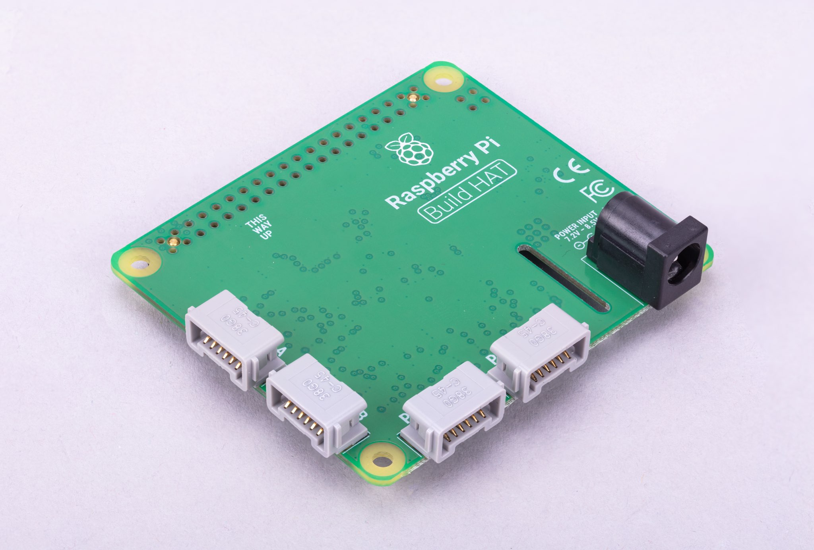

文档语言: [English](README.md) | [简体中文](README.zh-cn.md)

# 树莓派 构建 HAT

[树莓派Build HAT](https://raspberrypi.com/products/build-hat)是一个插件板，连接到您的树莓派的40针GPIO头，这是与乐高®教育合作设计的，以便轻松控制乐高®Technic™电机和传感器树莓派计算机。

[](https://www.raspberrypi.com/documentation/accessories/build-hat.html#introducing-the-build-hat)

## 文档

这个绑定使用了以下文档:

- 树莓派 [Build HAT](https://www.raspberrypi.com/documentation/accessories/build-hat.htm) documentation.
- 树莓派 Build HAT [串口协议](https://datasheets.raspberrypi.com/build-hat/build-hat-serial-protocol.pdf).
- 树莓派 Build HAT [官方的python库](https://datasheets.raspberrypi.com/build-hat/build-hat-python-library.pdf).
- [启动串行链路协议](https://www.philohome.com/wedo2reverse/protocol.htm)
- [启动连接器](https://www.philohome.com/wedo2reverse/connect.htm) 

## 已知的限制

这个实现基于那些正式的文档和逆向工程。并非所有的电机或传感器都经过了测试。

一旦启动，Build HAT没有任何预加载固件。这个绑定嵌入了一个固件，并且一旦连接就会上传这个版本的固件。第一次初始化可能需要几秒钟。

即使这个实现试图获得与[BrickPi 3](../BrickPi3)的一些兼容性，底层实现和传感器的工作方式也不同。不过，总的来说，它的原理与“砖头”、各种各样的发动机和传感器相当相似。

## 使用

主要元素是Brick。这就是Build HAT本身。注意Build HAT是基于串行端口的。因此，即使它采取树莓派帽子的形状，它实际上可以完美地与任何有串行端口的东西工作。

```csharp
// 在树莓派上，你将使用:
Brick brick = new("/dev/serial0");
```

在Windows上，你需要一个USB到串行适配器，将适配器的TX引脚连接到帽子上的TX(物理引脚8,GPIO 14)引脚。和RX引脚到RX(物理引脚10,GPIO 15)引脚。然后你只需要两边都有接地。重要的是**not to**连接RX到TX。

```csharp
// 在Windows下，通过串行适配器连接，调整端口号:
Brick brick = new("COM3");
```

不要忘记在代码的最后处理砖。如果你不这样做，你的程序就不会停止。

```csharp
brick.Dispose();
```

如果你想避免在最后调用' Dispose '，那么使用' using '语句创建你的砖块:

```csharp
// 在树莓派上，你将使用:
using Brick brick = new("/dev/serial0");
```
在这种情况下，当程序结束时，您的 brick 块将被自动处理。

### 显示的信息

你可以收集各种版本，签名和输入电压:

```csharp
var info = brick.BuildHatInformation;
Console.WriteLine($"版本: {info.Version}, 固件日期: {info.FirmwareDate}, 签名:");
Console.WriteLine($"{BitConverter.ToString(info.Signature)}");
Console.WriteLine($"Vin = {brick.InputVoltage.Volts} V");
```

注意:输入电压在启动时只读取一次，之后不读取。

### 获取传感器和电机的详细信息

函数' GetSensorType '， ' GetSensor '将允许您检索连接的传感器上的任何信息。

```csharp
SensorType sensor = brick.GetSensorType((SensorPort)i);
Console.Write($"Port: {i} {(Brick.IsMotor(sensor) ? "Sensor" : "Motor")} type: {sensor} Connected: ");
```

在这个例子中，你也可以使用' IsMotor '静态函数来检查连接的元素是传感器还是电机。

```csharp
if (Brick.IsActiveSensor(sensor))
{
    ActiveSensor activeSensor = brick.GetActiveSensor((SensorPort)i);
}
else
{
    var passive = (Sensor)brick.GetSensor((SensorPort)i);
    Console.WriteLine(passive.IsConnected);
}
```

' ActiveSensor '有一组高级属性和函数，允许理解传感器的每个元素。也可以从它们调用砖块中的原始函数。这将允许你选择特定的模式和做高级场景。虽然这是可能的，电机和传感器类已经创建，以使您的生活更容易。

### 事件

大多数传感器在其特殊属性上实现事件。你可以订阅“PropertyChanged”和“PropertyUpdated”。当值发生变化时，更改后的将被触发，而更新后的将在成功更新属性时被触发。根据使用的模式，一些属性可能一直在后台更新，而另一些则偶尔更新。

你可能只对颜色变化或电机位置变化感兴趣，用它作为转速表。在这种情况下，' PropertyChanged '就是你所需要的!

```csharp
Console.WriteLine("将A端口上的电机移动到100位以上，停止此测试。");
brick.WaitForSensorToConnect(SensorPort.PortA);
var active = (ActiveMotor)brick.GetMotor(SensorPort.PortA);
bool continueToRun = true;
active.PropertyChanged += MotorPropertyEvent;
while (continueToRun)
{
    Thread.Sleep(50);
}

active.PropertyChanged -= MotorPropertyEvent;
Console.WriteLine($"当前位置: {active.Position}, 事件停止.");

void MotorPropertyEvent(object? sender, PropertyChangedEventArgs e)
{
    Console.WriteLine($"属性改变: {e.PropertyName}");
    if (e.PropertyName == nameof(ActiveMotor.Position))
    {
        if (((ActiveMotor)brick.GetMotor(SensorPort.PortA)).Position > 100)
        {
            continueToRun = false;
        }
    }
}
```

### 等待初始化

brick 在初始化之前可能需要很长时间。实现了传感器连接等待。你可以这样使用它:

```csharp
brick.WaitForSensorToConnect(SensorPort.PortB);
```

如果你想实现高级功能，比如在一段时间后警告用户并重新尝试，它也可以采用' CancellationToken '。

### 电动机

有两种类型的电机，主动的和被动的。主动电机将提供详细的位置，绝对位置和速度，而被动电机只能控制速度。
有一套通用的功能来控制电机的速度。有两个重要的:' SetPowerLimit '和' SetBias ':

```csharp
train.SetPowerLimit(1.0);
train.SetBias(0.2);
```

可接受的值只在0.0到1.0之间。功率限制是按比例降低最大功率的一种方便方法。

偏置值设置为当前端口，该端口被添加到正电机驱动值，并从负电机驱动值中减去。这可以用来补偿这样一个事实，即大多数直流电动机需要一定的驱动才能转动。

当电机创建时，默认值为功率限制0.7，偏置0.3。

### 被动电动机

[](https://www.bricklink.com/v2/catalog/catalogitem.page?S=88011-1&name=Train%20Motor&category=%5BPower%20Functions%5D%5BPowered%20Up%5D#T=S&O={%22iconly%22:0})

典型的被动电机是火车和较老的动力电机。“速度”属性可以设置和读取。它是目标和被测速度的同时，因为那些传感器没有办法测量它们。取值范围为-100 ~ +100。

控制' Start '， ' Stop '和' SetSpeed '的函数也可用。下面是一个如何使用它的例子:

```csharp
Console.WriteLine("这将运行电机20秒增加PWM");
train.SetPowerLimit(1.0);
train.Start();
for (int i = 0; i < 100; i++)
{
    train.SetSpeed(i);
    Thread.Sleep(250);
}

Console.WriteLine("让train停下2秒");
train.Stop();
Thread.Sleep(2000);
Console.WriteLine("全速后退2秒");
train.Start(-100);
Thread.Sleep(2000);
Console.WriteLine("全速前进2秒");
train.Start(100);
Thread.Sleep(2000);
Console.WriteLine("停止train");
train.Stop();
```

注意:电动机启动后，可以调整速度，电机也会相应调整。

### Active Motors

[](https://www.bricklink.com/v2/catalog/catalogitem.page?S=88014-1&name=Technic%20XL%20Motor&category=%5BPower%20Functions%5D%5BPowered%20Up%5D#T=S&O={%22iconly%22:0})

主动电机有' Speed '， ' AbsolutePosition '， ' Position '和' TargetSpeed '作为特殊属性。即使在电机停止的情况下，它们也会被连续读取。

代码片段展示了如何获取马达，启动它们并读取属性:

```csharp
brick.WaitForSensorToConnect(SensorPort.PortA);
brick.WaitForSensorToConnect(SensorPort.PortD);
var active = (ActiveMotor)brick.GetMotor(SensorPort.PortA);
var active2 = (ActiveMotor)brick.GetMotor(SensorPort.PortD);
active.Start(50);
active2.Start(50);
//确保在A和D端口有一个活动电机插头
while (!Console.KeyAvailable)
{
    Console.CursorTop = 1;
    Console.CursorLeft = 0;
    Console.WriteLine($"绝对定位: {active.AbsolutePosition}     ");
    Console.WriteLine($"位置: {active.Position}     ");
    Console.WriteLine($"速度: {active.Speed}     ");
    Console.WriteLine();
    Console.WriteLine($"绝对定位: {active2.AbsolutePosition}     ");
    Console.WriteLine($"位置: {active2.Position}     ");
    Console.WriteLine($"速度: {active2.Speed}     ");
}

active.Stop();
active2.Stop();
```

注意:当需要时，不要忘记启动和停止你的马达。

先进的功能可用于主动电机。你可以要求移动几秒钟，到一个特定的位置，一个特定的绝对位置。下面是几个例子:

```csharp
// 从前面的例子来看，这将使马达回到它们的初始位置:
active.TargetSpeed = 100;
active2.TargetSpeed = 100;
// 首先这个马达将会阻塞线程
active.MoveToPosition(0, true);
// 然后这个也会阻塞线程
active2.MoveToPosition(0, true);
```

每个函数都允许在执行操作时阻塞或不阻塞线程。注意，对于绝对和相对位置的移动，有几个度的公差。

```csharp
brick.WaitForSensorToConnect(SensorPort.PortA);
var active = (ActiveMotor)brick.GetMotor(SensorPort.PortA);
active.TargetSpeed = 70;
Console.WriteLine("将电机移动到0号位置");
active.MoveToPosition(0, true);
Console.WriteLine("移动电机至3600位置(10圈)");
active.MoveToPosition(3600, true);
Console.WriteLine("将电机移动到-3600的位置(所以20转另一个方向");
active.MoveToPosition(-3600, true);
Console.WriteLine("电机移动到绝对位置0时，应旋转90°");
active.MoveToAbsolutePosition(0, PositionWay.Shortest, true);
Console.WriteLine("将马达移动到90号位置");
active.MoveToAbsolutePosition(90, PositionWay.Shortest, true);
Console.WriteLine("电机移动到179号位置");
active.MoveToAbsolutePosition(179, PositionWay.Shortest, true);
Console.WriteLine("将电机移动到-180度位置");
active.MoveToAbsolutePosition(-180, PositionWay.Shortest, true);
active.Float();
```

你可以将电机放置在浮动位置，这意味着它没有更多的约束。这是一种模式，当使用电机作为转速表，移动它和读取位置时，你可以使用。如果你仍然对马达有限制，你可能无法移动它。

### 传感器

就像马达一样，你有主动和被动传感器。最新的传感器是活跃的。被动的是灯和简单的按钮。主动的是距离，颜色传感器和小的3x3像素显示器。

#### 按钮/被动传感器接触

按钮/触摸无源传感器有一个特定的属性“IsPressed”。当按下按钮时，该属性被设置为true。下面是一个带有事件的完整示例:

```csharp
brick.WaitForSensorToConnect(SensorPort.PortA);
var button = (ButtonSensor)brick.GetSensor(SensorPort.PortA);
bool continueToRun = true;
button.PropertyChanged += ButtonPropertyEvent;
while (continueToRun)
{
    // 你可以在这里做很多其他的事情
    Thread.Sleep(50);
}

button.PropertyChanged -= ButtonPropertyEvent;
Console.WriteLine($"Button has been pressed, we're stopping the program.");
brick.Dispose();

void ButtonPropertyEvent(object? sender, PropertyChangedEventArgs e)
{
    Console.WriteLine($"Property changed: {e.PropertyName}");
    if (e.PropertyName == nameof(ButtonSensor.IsPressed))
    {
        continueToRun = false;
    }
}
```

### 无源光

[](https://www.bricklink.com/v2/catalog/catalogitem.page?P=22168c01&name=Electric,%20Light%20Unit%20Powered%20Up%20Attachment&category=%5BElectric,%20Light%20&%20Sound%5D#T=C&C=11)

被动光源是火车灯。它们可以被打开，你可以控制它们的亮度。

```csharp
brick.WaitForSensorToConnect(SensorPort.PortA);
var light = (PassiveLight)brick.GetSensor(SensorPort.PortA);
// 亮度50%
light.On(50);
Thread.Sleep(2000);
// 70%的亮度
light.Brightness = 70;
Thread.Sleep(2000);
// 关掉灯
light.Off()
```

### 主动传感器

有源传感器是由所有有源传感器继承而来的一类通用传感器，包括有源电机。它们包含一组关于如何连接到Build HAT的属性、模式、详细的组合模式、硬件、软件版本和一个名为“ValueAsString”的特定属性。作为字符串的值包含作为字符串集合的最后一次测量值。一个度量值到达像' P0C0: +23 -42 0 '，枚举将包含' P0C0: '， ' +23 '， ' -42 '和' 0 '。这是为了让你使用高级模式和管理自己的组合模式和命令，你将能够得到测量。

所有有源传感器都可以运行特定的测量模式或组合模式。您可以通过使用' SelectModeAndRead '和' SelectCombiModesAndRead '函数来设置一个高级模式，并指定您想持续使用的特定模式。重要的是要明白，更改模式或设置一个新模式将停止前一个模式。

可以在Combi模式下组合的模式列在“CombiModes”属性中。当你设置其中一种模式时，传感器的所有属性都会自动更新。

### 我们倾斜传感器

[](https://www.bricklink.com/v2/catalog/catalogitem.page?S=45305-1&name=WeDo%202.0%20Tilt%20Sensor&category=%5BEducational%20&%20Dacta%5D%5BWeDo%5D#T=S&O={%22iconly%22:0})

WeDo倾斜传感器有一个特殊的“倾斜”属性。类型是一个点，X是X倾斜，Y是Y倾斜。这些值从-45到+ 45，它们以这些值为顶角，并表示度数。

您可以使用“ContinuousMeasurement”属性为该传感器设置连续测量。

```csharp
brick.WaitForSensorToConnect(SensorPort.PortA);
var tilt = (WeDoTiltSensor)brick.GetSensor(SensorPort.PortA);
tilt.ContinuousMeasurement = true;
Point tiltValue;
while(!console.KeyAvailable)
{
    tiltValue = tilt.Tilt;
    console.WriteLine($"Tilt X: {tiltValue.X}, Tilt Y: {tiltValue.Y}");
    Thread.Sleep(200);
}
```

### WeDoDistance传感器

[](https://www.bricklink.com/v2/catalog/catalogitem.page?S=45304-1&name=WeDo%202.0%20Motion%20Sensor&category=%5BEducational%20&%20Dacta%5D%5BWeDo%5D#T=S&O={%22iconly%22:0})

WeDo距离传感器给你一个毫米的距离与距离属性。

```csharp
brick.WaitForSensorToConnect(SensorPort.PortA);
var distance = (WeDoDistanceSensor)brick.GetSensor(SensorPort.PortA);
distance.ContinuousMeasurement = true;
while(!console.KeyAvailable)
{    
    console.WriteLine($"Distance: {distance.Distance} mm");
    Thread.Sleep(200);
}
```

### 尖刺力传感器

[](https://www.bricklink.com/v2/catalog/catalogitem.page?P=37312c01&name=Electric%20Sensor,%20Force%20-%20Spike%20Prime&category=%5BElectric%5D#T=C&C=11)

这个力传感器测量施加在它身上的压力，以及它是否被按压。这两个属性可以通过' Force '和' IsPressed '属性访问。

```csharp
brick.WaitForSensorToConnect(SensorPort.PortA);
var force = (ForceSensor)brick.GetSensor(SensorPort.PortA);
force.ContinuousMeasurement = true;
while(!force.IsPressed)
{    
    console.WriteLine($"Force: {force.Force} N");
    Thread.Sleep(200);
}
```

### SPIKE Essential 3x3彩色光矩阵

[](https://www.bricklink.com/v2/catalog/catalogitem.page?P=45608c01&name=Electric,%203%20x%203%20Color%20Light%20Matrix%20-%20SPIKE%20Prime&category=%5BElectric%5D#T=C)

这是一个3x3的小显示器，有9个不同的led，可以单独控制。该类公开了能够控制屏幕的函数。下面是一个使用它们的例子:

```csharp
brick.WaitForSensorToConnect(SensorPort.PortA);
var matrix = (ColorLightMatrix)brick.GetSensor(SensorPort.PortA);
for(byte i = 0; i < 10; i++)
{
    // 是否会像进度条一样一个接一个地点亮每一个led
    matrix.DisplayProgressBar(i);
    Thread.Sleep(1000);
}

for(byte i = 0; i < 11; i++)
{
    // 会用相同的颜色显示矩阵并遍历所有的矩阵吗
    matrix.DisplayColor((LedColor)i);
    Thread.Sleep(1000);
}

Span<byte> brg = stackalloc byte[9] { 1, 2, 3, 4, 5, 6, 7, 8, 9 };
Span<LedColor> col = stackalloc LedColor[9] { LedColor.White, LedColor.White, LedColor.White,
  LedColor.White, LedColor.White, LedColor.White, LedColor.White, LedColor.White, LedColor.White };
// 灰色的阴影
matrix.DisplayColorPerPixel(brg, col);
```

### SPIKE Prime颜色传感器和颜色和距离传感器

SPIKE color sensor:

[](https://www.bricklink.com/v2/catalog/catalogitem.page?P=37308c01&name=Electric%20Sensor,%20Color%20-%20Spike%20Prime&category=%5BElectric%5D#T=C&C=11)

颜色和距离传感器:

[](https://www.bricklink.com/v2/catalog/catalogitem.page?P=bb0891c01&name=Electric%20Sensor,%20Color%20and%20Distance%20-%20Boost&category=%5BElectric%5D#T=C&C=1)

这些颜色传感器具有多种特性和功能。你可以得到“颜色”，“反射光”和“环境光”。

在此之上，颜色和距离传感器可以测量“距离”，并有一个对象“计数器”。它会自动计数进入和离开范围的对象的数量。这允许计数通过传感器前面的物体。距离限制在0到10厘米之间。

```csharp
brick.WaitForSensorToConnect(SensorPort.PortC);

var colorSensor = (ColorAndDistanceSensor)brick.GetActiveSensor(SensorPort.PortC);
while (!Console.KeyAvailable)
{
    var colorRead = colorSensor.GetColor();
    Console.WriteLine($"颜色:     {colorRead}");
    var relected = colorSensor.GetReflectedLight();
    Console.WriteLine($"反射: {relected}");
    var ambiant = colorSensor.GetAmbiantLight();
    Console.WriteLine($"周围:   {ambiant}");
    var distance = colorSensor.GetDistance();
    Console.WriteLine($"距离: {distance}");
    var counter = colorSensor.GetCounter();
    Console.WriteLine($"计数器 :  {counter}");
    Thread.Sleep(200);
}
```

注:为了更好的测量，不建议用非常快的方式改变测量方式，可能无法正确的进行颜色的整合。这个示例向您全面介绍了您可以使用传感器做什么。此外，该类不实现连续度量模式。你可以通过使用' SelectModeAndRead '函数在高级模式中设置一个你想持续使用的特定模式。重要的是要明白，更改模式或设置一个新模式将停止前一个模式。

### SPIKE Prime超声波距离传感器

[](https://www.bricklink.com/v2/catalog/catalogitem.page?P=37316c01&name=Electric%20Sensor,%20Distance%20-%20Spike%20Prime&category=%5BElectric%5D#T=C&C=11)

这是一个距离传感器，它实现了一个' distance '属性，它会给出以毫米为单位的距离。“连续测量”模式也可用在这一个。

```csharp
brick.WaitForSensorToConnect(SensorPort.PortA);
var distance = (UltrasonicDistanceSensor)brick.GetSensor(SensorPort.PortA);
distance.ContinuousMeasurement = true;
while(!console.KeyAvailable)
{    
    console.WriteLine($"距离 : {distance.Distance} mm");
    Thread.Sleep(200);
}
```
