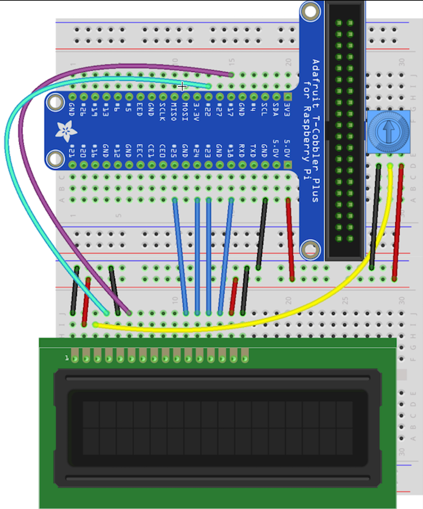

文档语言: [English](README.md) | [简体中文](README.zh-cn.md)

# 字符液晶显示(液晶显示)

此设备绑定用于使用HD44780兼容控制器的字符LCD显示器。几乎所有的字符液晶显示器都属于这一类。包括16x2和20x4变体的简单包装器。

请确保您正在使用 [最新绑定nuget](https://github.com/dotnet/iot#how-to-install).

## Documentation

该绑定已经在各种16x2和20x4显示器(4bit和8bit模式)和通过i2C适配器(如在CrowPi上)进行了测试。它应该与任何字符LCD与5x8大小的字符。常用的名称是1602LCD和2004LCD。还支持[Grove -LCD RGB背光](http://wiki.seeedstudio.com/Grove-LCD_RGB_Backlight/)。

- [非常完整的教程](https://learn.adafruit.com/drive-a-16x2-lcd-directly-with-a-raspberry-pi/overview) 如何连接和使用这些显示器。
- [很好的向导](http://www.site2241.net/november2014.htm) 解释设备内部的工作原理
- Seeedstudio, Grove - [液晶RGB背光库](<https://github.com/Seeed-Studio/Grove_LCD_RGB_Backlight>)
- [PCF8574T 资料](https://alselectro.wordpress.com/2016/05/12/serial-lcd-i2c-module-pcf8574/)

## 使用

这些设备完全由GPIO控制(除了格罗夫液晶RGB背光)。使用了两种不同类型的GPIO引脚，控制引脚和数据引脚。数据引脚将发送应该打印在LCD屏幕上的文本。该绑定支持数据引脚的两种不同配置:使用4个数据引脚和使用8个数据引脚。当只使用4个数据引脚时，我们将要求两个向控制器发送两个消息，每个发送应该打印的字节的一半。

下面是如何使用这个绑定的Hello World示例:

```csharp
using (var lcd = new Lcd1602(18, 5, new int[]{6, 16, 20, 21})) //using 4 data pins
{
    lcd.Write("Hello World!");
}
```

Grove LCD RGB背光使用两个i2c器件:

- 用于控制LCD的设备(地址0x3E)
- 控制RGB背光的设备(地址0x62)

确保Grove-LCD RGB背光连接到I2C端口。不是数字端口!
这是一个Hello World的例子，如何使用Grove LCD RGB背光绑定:

```csharp
var i2cLcdDevice = I2cDevice.Create(new I2cConnectionSettings(busId: 1, deviceAddress: 0x3E));
var i2cRgbDevice = I2cDevice.Create(new I2cConnectionSettings(busId: 1, deviceAddress: 0x62));
using LcdRgb lcd = new LcdRgb(new Size(16, 2), i2cLcdDevice, i2cRgbDevice);
{
    lcd.Write("Hello World!");
    lcd.SetBacklightColor(Color.Azure);
}
```

PCF8574T / PCF8574AT样本
基于PCF8574T/AT IC的I2C双肩背包采用了特定的引脚映射，将此器件绑定在此双肩背包上使用如下

```csharp
var i2cDevice = I2cDevice.Create(new I2cConnectionSettings(busId: 1, deviceAddress: 0x27));
var controller = new Pcf8574(i2cDevice);
var lcd = new Lcd1602(registerSelectPin: 0, enablePin: 2, dataPins: new int[] { 4, 5, 6, 7}, backlightPin: 3, readWritePin: 1, controller: controller);
```

在示例目录中有一个完整的工作示例，名为Pcf8574tSample.cs
对于PCF8574T, i2c地址可以在0x27和0x20之间，这取决于桥接焊锡跳线，而对于PCF8574AT, i2c地址可以在0x3f和0x38之间，这取决于桥接焊锡跳线

该设备绑定可以与[ShiftRegister](https://github.com/dotnet/iot/tree/main/src/devices/ShiftRegister/README.md)绑定结合使用，以便使用移位寄存器驱动HD44780显示器。[ShiftRegister](https://github.com/dotnet/iot/tree/main/src/devices/ShiftRegister/README.md)绑定支持通过GPIO或SPI进行交互。任何移位寄存器都可以使用，只要它的输出长度能被8整除。例子:

```csharp
int registerSelectPin = 1;
int enablePin = 2;
int[] dataPins = new int[] { 6, 5, 4, 3 };
int backlightPin = 7;
// Gpio
using ShiftRegister sr = new(ShiftRegisterPinMapping.Minimal, 8);
// Spi
// using SpiDevice spiDevice = SpiDevice.Create(new(0, 0));
// using ShiftRegister sr = new(spiDevice, 8);
using LcdInterface lcdInterface = LcdInterface.CreateFromShiftRegister(registerSelectPin, enablePin, dataPins, backlightPin, sr);
using Lcd1602 lcd = new(lcdInterface);
```

示例代码与Adafruit的代码一起工作[I2C / SPI 字符液晶背包](https://learn.adafruit.com/i2c-spi-lcd-backpack)它使用[Sn74hc595](https://github.com/dotnet/iot/blob/main/src/devices/Sn74hc595/README.md) 8位移位寄存器支持SPI通信。别针的参数是根据背包的尺寸设定的 [电路图](https://learn.adafruit.com/i2c-spi-lcd-backpack/downloads).

## 字符液晶显示

[不同的样品](https://github.com/dotnet/iot/tree/main/src/devices/CharacterLcd/samples) 被提供。主要的方法是使用主板的Gpio引脚来驱动液晶显示器。第二个示例将使用MCP Gpio扩展器背包来驱动LCD显示。第二个例子可以通过i2c总线使用Grove RGB LCD背光。第二个例子已经在CrowPi设备和Grove LCD RGB背光设备上进行了测试。

### 构建配置

请根据连接的设备使用配置键构建示例项目:

- 对于GPIO连接，您不需要使用任何配置键。例子:

```shell
dotnet publish -o C:\DeviceApiTester -r linux-arm
```

- MCP GPIO扩展背包请使用*USEI2C*键。例子:

```shell
dotnet publish -c USEI2C -o C:\DeviceApiTester -r linux-arm
```

- 格罗夫RGB液晶背光请使用*USERGB*键。例子:

```shell
dotnet publish -c USERGB -o C:\DeviceApiTester -r linux-arm
```

### 示例连接


